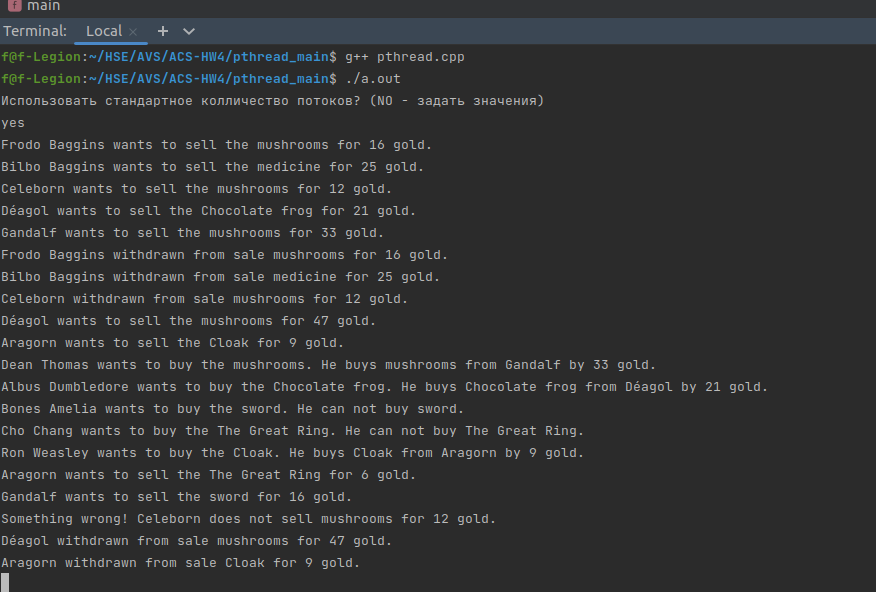
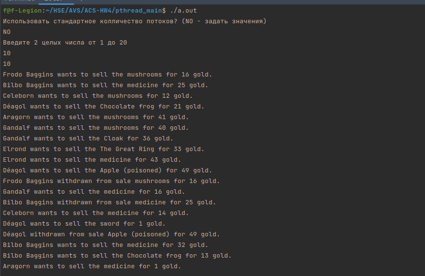
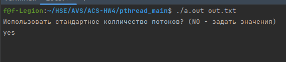
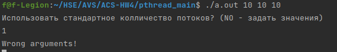
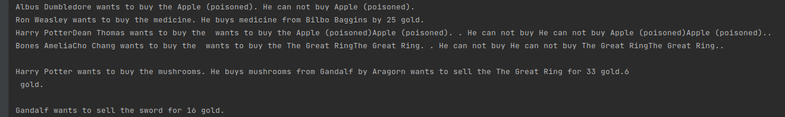
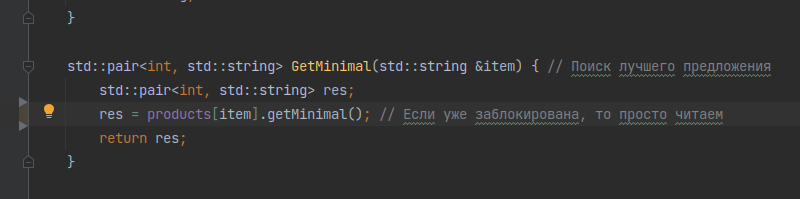
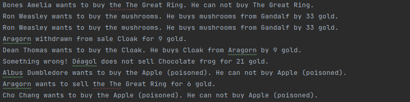

# Четвертое домашнее задание по архитектуре вычислительных систем
## Фирсов Федор БПИ219 
### Вариант 36 Задача о читателях и писателях-3 («подтвержденное чтение»). 
#### Я надеюсь что ничего не упустил и это работа на 9)
#### Моя интерпретация

В сказочном мире есть рынок на котором герои могут продавать и покупать вещи, которые понадобятся им в скитаниях.
Все, кто приходят на рынок, хотят или продать ненужные волшебные предметы, или купить что-то для своих странствий.

Когда продавец приходит на рынок он выставляет свой товар на продажу за определенную цену. Поэтому на рынке регулярно слышны крики вида: "Баба Яга выставила на продажу мухоморы за 2 золотые!"

Иногда у продавца заканчивается товар и тогда разноситься крик "Леший перестал продавать волшебный мох за 25 золотых."

Покупатели же приходят с понятным желанием купить только нужные им предметы. 
Причем золотые на дороге не валяются и герои стараются потратить их ка можно меньше.
Так например Гарри Поттер при входе на рынок подумал "Я хочу купить волшебную палочку.", и сравнив все варианты рынок услышал крик: "Гарри Поттер купил волшебную палочку у Хагрида за 10 золотых.".
А Рон не нашел ни одного продавца зеоий поэтому по рынку пошел слух: "Рон Уизли зочел купить зелье, но не смог этого сделать."

### Решение

Решение написано на C++ с использованием библиотеки Pthread и находится в файле [pthread.cpp](pthread_main/pthread.cpp).

В моем решении есть потоки трех типов:
1) Главный поток - Определяет формат ввода-вывода, колличество потоков и создает остальные потоки.
2) Поток-продавец - Пишущий поток. Моделирует поведение продавцов на рынке: время от времени выставляет и убирает некоторые товары (не обязательно у одного продавца).
3) Поток-покупатель - Читающий поток. Время отверемени находит самое дешевое актуальное предложение по продаже товара. Никак не меняет БД.

#### Синхронизация.
Для синхронизации потоков искользуется mutex - двоичный семафор, который показывает доступна ли сейчас база данных для записи.
Так поток писатель ожидает разблокировки семафора для записи в БД, который блокируют и потоки-писатели и потоки-читатели.
А потоки-читатели всегда имеют доступ к БД.

Также для моделирования вывода я добавил еще 1 семафор. Он нужен исключительно для того, чтобы в потоке вывода сообщения не перебивали друг-друга. Если бы мы выводили сообщкния каждого потока в свой файл, то он был бы не нужен.

#### Запуск
1) без аргументов - консольный ввод-вывод
2) consele filename - файловый ввод-вывод
3) int int - колличество потоков-писателей и потоков-чтецов

#### Отключение синхропримитивов

Для начала отключим где-нибудь блокировку write_mutex. Это очевидно повлечет за собой смешивание вывода:
При отключении в BuyersGenerator то есть для покупателей видим что-то такое:

Аналогичный хаос при выводе видим и при отключении его в других местах.

Теперь отключим блокировку потоком-чтецом потоков писателей так:

Теперь какой-то поток, модет начать писать одновременно с тем, как другой читает.
По идее кто-то может купить что-то, что уже сняли с продажи, но время составления запроса к мрей БД очень маленькое, и я не смог найти такого в логах(

Осталось посмотреть, что будет при отключении блокировки писателя. (Писатель вообще не обращает внимания на mutex)

Как мы видим Dean Thomas успел купить то, что по идее уже сняли с продажи)
Это произошло, так как видимо писатель начал менять БД одновременно с запросом читателя, или наоборот.
